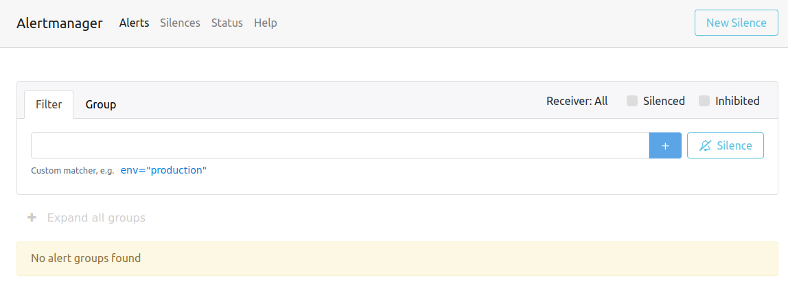
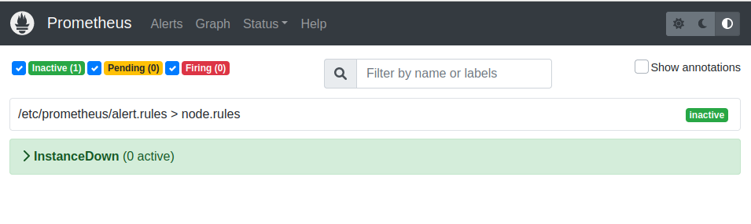

# Alert Manager

## Components

* the same components as in the [basics playground](./basics.md) plus
  * [docker-compose.yaml](../../playgrounds/alerting/docker-compose.yaml)
  * [prometheus.yml](../../playgrounds/alerting/prometheus/prometheus.yml)
  * [alert.rules](../../playgrounds/alerting/prometheus/alert.rules)
* an Alert Manager instance
  * [alertmanager.yml](../../playgrounds/alerting/alertmanager/alertmanager.yml)
* a Webmailer instance

## Run playground

```shell
cd /home/vagrant/playgrounds/alerting
```

```shell
./run.sh
```

## Stop playground

```shell
./stop.sh
```

## What have we got?


### Alert Manager

* [Alert Manager UI](http://127.0.0.1:9093)

<details>
<summary>Show / hide</summary>



</details>

### Prometheus Dashboard Alerting Pager

* [Prometheus Dashboard](http://127.0.0.1:9090/graph)

<details>
<summary>Show / hide</summary>



</details>

### Mailhog Webmailer to receive Alerts

* [Webmail](http://127.0.0.1:8025)

## Things to do with this playground

### Trigger alert

```shell
docker-compose stop service-a
```

[Watch Prometheus](http://127.0.0.1:9090/alerts)

---
[back](../overview.md)
