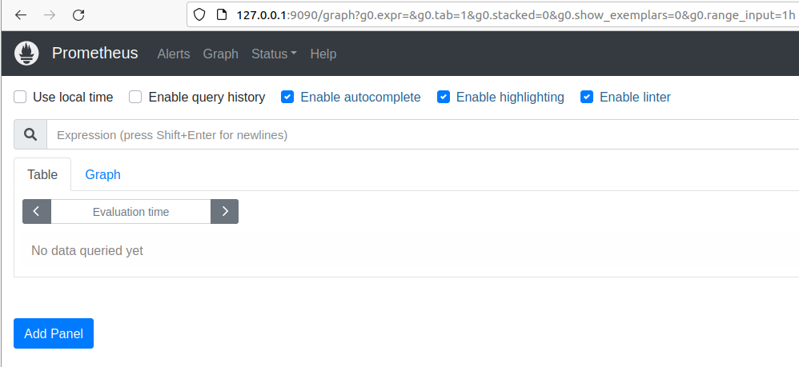
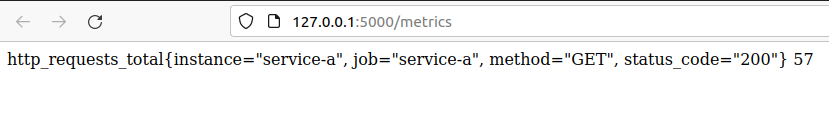
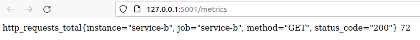

# Playground: Basics

## Components

* two simple Flask webservices (Service A, Service B) that expose `GET /metrics`
  * [service.py](../../playgrounds/shared/service/service.py)
  * [docker-compose.yaml](../../playgrounds/shared/service/docker-compose.yaml)
* a Prometheus instance that is configured to scrape both `/metrics` endpoints
  * [docker-compose.yaml](../../playgrounds/basics/docker-compose.yaml)
  * [prometheus.yml](../../playgrounds/basics/prometheus.yml)

## Run playground

```shell
cd /home/vagrant/playgrounds/basics
```

```shell
./run.sh
```

## What have we got?

### Prometheus Dashboard

* [Prometheus Dashboard](http://127.0.0.1:9090/graph)

<details>
<summary>Show / hide</summary>



</details>

### Service Metrics

* [Service A metrics](http://127.0.0.1:5000/metrics)

<details>
<summary>Show / hide</summary>



</details>

* [Service B metrics](http://127.0.0.1:5001/metrics)

<details>
<summary>Show / hide</summary>



</details>

## Things to do with this playground

* Watch the metrics the services are exposing
* Investigate where you can see the configured targets on the Prometheus dashboard
* Run a simple query on the Prometheus Dashboard (example `http_requests_total{}`)

---
[back](../overview.md)
