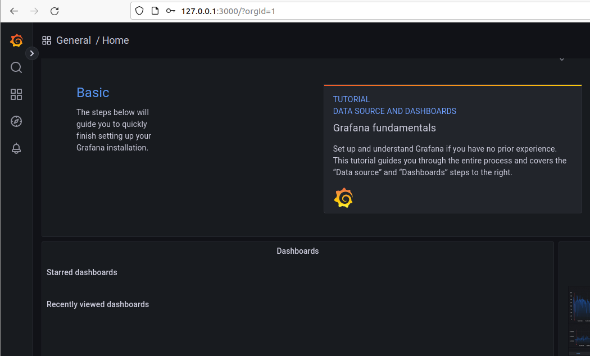
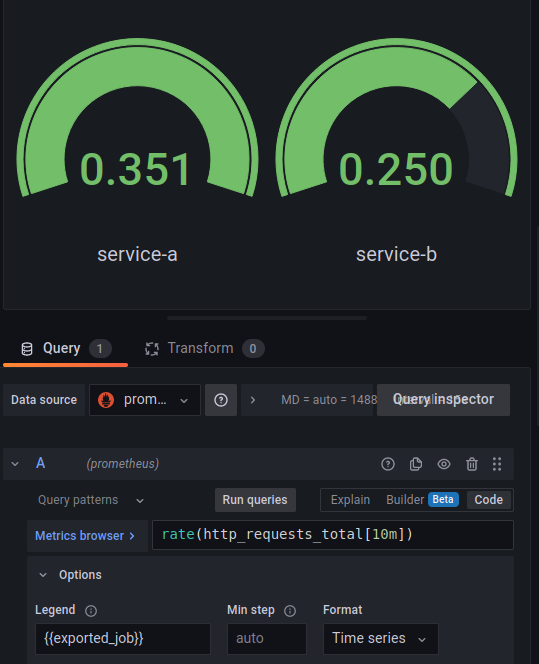

# Grafana

## Components

* the same components as in the [basics playground](./basics.md)
* a Grafana instance
  * [docker-compose.yaml](../../playgrounds/grafana/docker-compose.yaml)

## Run playground

```shell
cd /home/vagrant/playgrounds/grafana
```

```shell
./run.sh
```

## What have we got?

* [Grafana Dashboard](http://127.0.0.1:3000) (username: admin,  password: admin)

<details>
<summary>Show / hide</summary>



</details>

## Things to do with this playground

### Add Prometheus as Data Source

* [Grafana Data sources](http://127.0.0.1:3000/datasources)

*Add source -> Prometheus -> Url: http://prometheus:9090 -> Save & Test*

### Create Dashboard

* Example rate gauge:
  * Use `rate(http_requests_total[10m])`
  * change the type to `Gauge`

<details>
<summary>Show / hide</summary>



</details>

---
[back](../overview.md)
